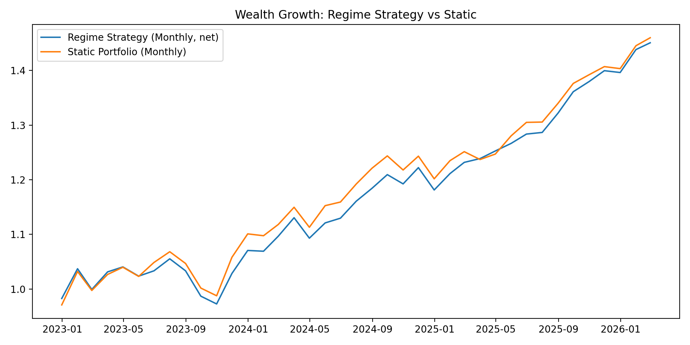
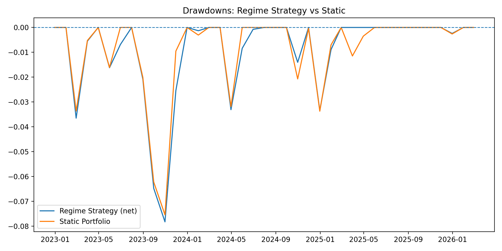
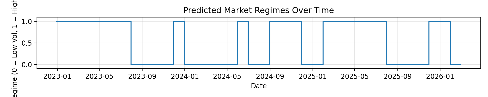
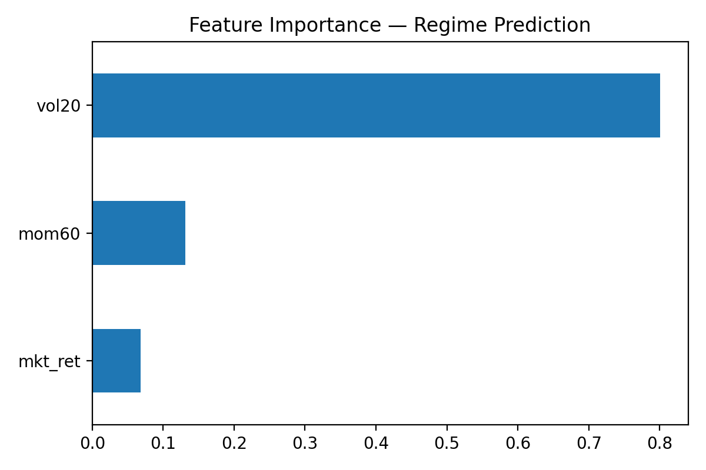
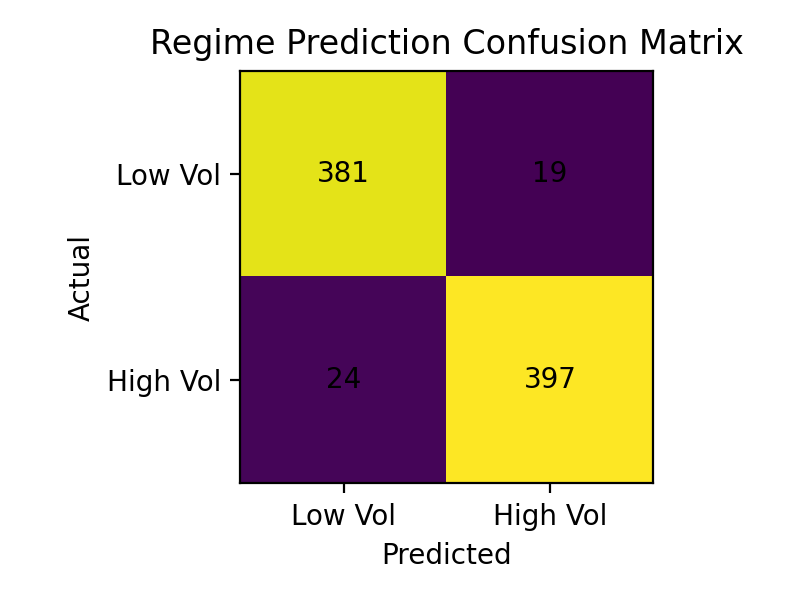
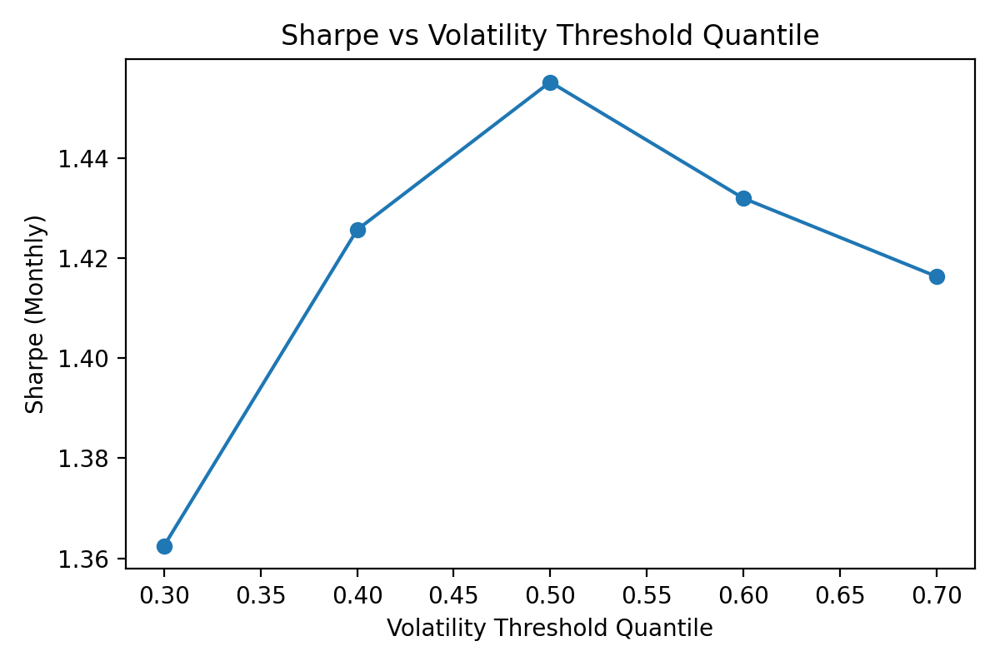

# 📊 Regime-Based Dynamic Asset Allocation (ML-Driven)

## Overview
This project builds a **machine learning–driven market regime detection system** and uses it to dynamically allocate assets between equities, bonds, gold, and real estate.

The strategy predicts **future market volatility regimes (Low-Vol vs High-Vol)** using market features and adjusts portfolio weights accordingly.

**Goal:** Improve **risk-adjusted returns**, volatility control, and drawdown behavior vs a static allocation.

---

## Assets Used
- **SPY** — US Equity Market  
- **EFA** — International Equity  
- **AGG** — Bonds  
- **GLD** — Gold  
- **VNQ** — Real Estate  

**Data period:** 2015-01-02 to 2026-02-12  
**Prices shape:** (2795, 5)  
**Returns shape:** (2794, 5)  
**Monthly returns shape:** (134, 5)

---

## Regime Definition
We define market regimes using **20-day rolling volatility of SPY**:

- `0 = Low Vol` (Risk-On)
- `1 = High Vol` (Risk-Off)

**Regime counts (SPY):**
- Low Vol (0): 1368
- High Vol (1): 1366

---

## Features Used
We predict the next regime using three simple but effective signals:
- `vol20`  → 20-day rolling volatility (risk proxy)
- `mom60`  → 60-day momentum/trend proxy
- `mkt_ret` → daily SPY return

---

## Machine Learning Model
Model: **RandomForestClassifier**

Why Random Forest?
- Captures **non-linear relationships**
- Robust to **noise** in financial data
- Ensemble reduces overfitting vs a single tree

---

## Out-of-Sample Performance (Daily Regime Prediction)
Train/Test split is done **chronologically** (no shuffling).

**Test Accuracy:** ~0.95  

**Classification Report (Test):**
- Class 0 (Low Vol): Precision ~0.94, Recall ~0.95  
- Class 1 (High Vol): Precision ~0.95, Recall ~0.94  

---

## Strategy Construction

### Dynamic Regime Weights
**Low Vol (Risk-On):**
- SPY 40%
- EFA 20%
- AGG 20%
- GLD 10%
- VNQ 10%

**High Vol (Risk-Off):**
- SPY 15%
- EFA 10%
- AGG 45%
- GLD 20%
- VNQ 10%

### Static Benchmark Weights
- SPY 30%
- EFA 20%
- AGG 30%
- GLD 10%
- VNQ 10%

---

## Backtest Methodology
We convert daily signals to monthly rebalancing:
1. Predict daily regime (out-of-sample / walk-forward)
2. Take the **month-end regime** signal
3. Apply weights for the next month
4. Include transaction cost on regime switches

**Transaction cost:** 0.10% per regime switch (0.001)

---

## Results (Monthly, Net of Transaction Costs)

### Main Metrics Table
| Strategy | Ann Return | Ann Vol | Sharpe | Max DD |
|---------|-----------:|--------:|-------:|-------:|
| Regime Strategy (net) | 0.1213 | 0.0830 | 1.4254 | -0.0783 |
| Static Portfolio      | 0.1234 | 0.0897 | 1.3468 | -0.0754 |

### Extra printed metrics (from notebook)
- Dynamic Sharpe (monthly): **1.2642**
- Static Sharpe (monthly): **0.7782**
- Dynamic CAGR: **0.1063**
- Static CAGR: **0.0731**
- Dynamic Max DD: **-0.1798**
- Static Max DD: **-0.2106**

> Note: Some values differ depending on whether you're using **daily vs monthly**, and whether you're showing **gross vs net** returns.

---

## Probability-Weighted Strategy (Advanced)
Instead of using only a hard 0/1 regime switch, we also tested using the model’s **predicted probability** to reduce switching noise.

**Out-of-sample predicted regime counts:**
- Regime 1: 1104
- Regime 0: 854

**Probability summary:**
- mean: 0.5637  
- std: 0.4556  
- min: 0.0000  
- 25%: 0.0204  
- 50%: 0.9089  
- 75%: 0.9834  
- max: 1.0000  

**Avg turnover (prob strategy):** 0.1016

---

## Benchmarks Added
We compared results against:
- **Static portfolio**
- **60/40** benchmark
- **Risk Parity** benchmark

Benchmarks availability in sample:
- 60/40 months: 39  
- Risk Parity months: 28  

---

## Sensitivity Analysis (Threshold Robustness)
We tested different volatility thresholds using quantiles:
`q = [0.30, 0.40, 0.50, 0.60, 0.70]`

Best Sharpe appeared around:
- **0.50 quantile threshold**

This suggests performance is not overly dependent on one specific threshold.

---

## Feature Importance
Random Forest feature importance shows:
- `vol20` is dominant (~0.80)
- `mom60` (~0.13)
- `mkt_ret` (~0.07)

Interpretation: volatility is the main driver of regime classification.

---

## Visualizations
Place your plots in `results/` and keep these names:

- `results/wealth_curve.png`
- `results/drawdowns.png`
- `results/feature_importance.png`
- `results/confusion_matrix.png`
- `results/parameter_sensitivity.png`
- `results/regime_timeline.png`
- `results/wealth_with_regime_shading.png`

Example embedding:

### Wealth Curve (Dynamic vs Static)

### Drawdowns

### Regime Timeline

### Feature Importance

### Confusion Matrix

### Threshold Sensitivity

---

## Project Structure
Recommended structure:

**Confusion Matrix:**

